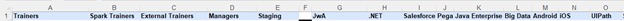

---

# QC Scheduler Assistant Read Me

Roderick Lewis, Steven Agnor, Hassan Barakka
[date]

---

## Software Prerequisites and UiPath Packages [disaggregate and filter]

This Automation requires the use of:
- Microsoft Excel
- Microsoft Word 
- Microsoft PDF 
- UiPath Orchestrator
- UiPath Assistant
- UiPath.UIAutomation.Activities v21.10.3
- UiPath.System.Activites v21.10.2
- UiPath.Excel.Activities v2.11.4
- UiPath.WebAPI.Activities v1.9.2
- UiPath.Mail.Activities v1.12.3

__Special note__: To run effectively, both Excel, Word, and PDF, or the entire Microsoft Office suite should be installed on the local machine, and there should be no open instances of these programs.

---

## Features

### MVP

In the markdown language (file extension .md). The subsections for the MVP functions need to be noted in this format:
- [x] MVP 1 - Assign Quality Auditors 
- [x] MVP 2 - Identify Secondary Auditors 
- [x] MVP 3 - Track PTO Status 
- [x] Remove Batches 
- [x] Email & PDF Automations 

## Stretch Goals 

- [x] Automatically Schedule Showcase 

---

## Input of Automation

The necessary input for this automation is an Excel Document in the form of a Storage Bucket saved in our project group's organization Tenant Orchestrator, named “Schedule.” This input is updated after every iteration of our automation, and the previous Storage Bucket is deleted before our automation is complete. 
The excel file must have several premade sheets and populated columns otherwise there will be no references for critical parts within the automation. The three specific sheets needed in the Excel document are: "Quality Analyst Skillset," "Trainer Info & Skillsets," and the last sheet in the workbook sheet name must be in month, day, year format so preceding sheets will be scheduled on the following Monday of the week. 
Each of these sheets must be in a specific format that was pre-designed by our project owner. The auditor skill set table is based first on the “Skills Scale'' table found in the "Quality Analyst Skillset,"sheet. It must be set up in the following format, that uses colors as equivalencies.

The other table necessary in the "Quality Analyst Skillset,"sheet is the auditors table, that gives them a skill value for each one of the 14 software development tools that revature batches are trained in.

Next, the "Trainer Info & Skillsets," must have each one of the columns below, with populated trainer names that can be assigned to operational batches.

The Last sheet is the most important, and was begun on “12-6-21” which is the corresponding title. This sheet name allows for seven days to the new excel sheet, and storage bucket that is generated after every iteration. The columns that must be supplied are the “Batches,” and “QC wk,” so that specific batches can be paired with primary auditors at appropriate skill levels, while taking into account different training milestones such as P0, coding assessments, and showcases.

---

## Output of Automation
The outputs for our automation, the Updated Storage Bucket named “Schedule” and Email with PDF Attachment, require the user to provide a specific email address before initiating the automation by clicking the “Scheduler Assistant” button on the Web App API. To access the updated Storage Bucket “Automation User” and “Automation Developer permissions must be associated with the desired user, within the organization Tenant for the specific “Scheduler Assistant” folder where the latest version of the automation is published. 
It is also necessary for the user to run the automation on a machine that has Microsoft Word, Powerpoint, and Excel installed, but no open instances of these programs running during use. 
## License prerequisites
- Windows 10 Home/Pro license 
- Microsoft Word and Excel license
- UiPath Studio license with access to both Unattended & Attended Robots
## Software prerequisites
- Windows 10
- UiPath 2021.10.3
- UiPath Assistant
- Uipath Orchestrator
  - https://cloud.uipath.com/
- Microsoft Word
- Microsoft Excel
- Git

## UiPath Studio Project Dependencies (minimum package version requirements)
- UiPath.UIAutomation.Activities v21.10.3
- UiPath.System.Activites v21.10.2
- UiPath.Excel.Activities v2.11.4
- UiPath.WebAPI.Activities v1.9.2
- UiPath.Mail.Activities v1.12.3
